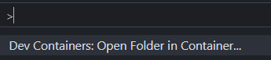
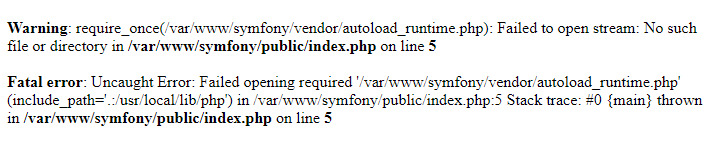

# SIROKO API - Prueba técnica

## Description

El proyecto está montado con con el siguiente stack:

- 🐳 Docker
-  PHP 8.2
-  MySQL 8.0
-  Nginx 
-  Symfony 6.2

Que estará compuesto por 3 contenedores, aunque el de db no lo utilizaremos en esta primera versión:

- `nginx`, actua como servidor web.
- `php`, el contenedor PHP-FPM con la versión 8.2 de PHP.
- `db` este será el contenedor de la base de datos de MySQL con la imagen de **MySQL 8.0**.
  
La APP: 

- Es una API REST, con JSON como formato de salida.
- Los campos a mostrar serán: 
    - id: Identificador único del producto.
    - name: Nombre del producto.
    - description: Descripción del producto.
    - price: Precio del producto.
    - quantity: Cantidad del producto en el carrito.
    - total_price: Precio total para la cantidad de productos en el carrito.
    - image_url: URL de la imagen del producto.
    - category: Categoría a la que pertenece el producto.
    - sku: Código de referencia del producto (Stock Keeping Unit).
    - availability: Disponibilidad del producto (en stock, fuera de stock).
    - discount: Descuento aplicado al producto, si corresponde.
    - brand: Marca del producto.
    - rating: Calificación del producto.
    - reviews: Número de reseñas del producto.
- Construida en Arquitectura Hexagonal y DDD.
- Aplicación con estandares [PSR-2].

## Extras

Como mejora de la aplicación he añadido lo siguiente:

- Peticiones a API cacheadas temporalmente mediante Redis.
- Documentacion del API mediante OpenAPI. Usando en este caso [NelmioAPIBundle].

## Instalación

### Version corta despliegue

1. Desde donde quieras clonar el proyecto lanzar el comando `make clone-deploy`, el cual clonará el repo y deplegará la APP.

### Version larga despliegue

1. Clonar el repo 😁, lanzando el comando `git clone https://github.com/z3myY/siroko-symfony-api.git` en la carpeta que quieras en local.
2. Crear el archivo `./.docker/.env.nginx.local` usando `./.docker/.env.nginx` como plantilla. El valor de la variable `NGINX_BACKEND_DOMAIN` es el `server_name` usado en NGINX. Para no complicarme simplemente le he puesto `localhost`.
3. Ir a la carpeta `./docker` y ejecutar `docker compose up -d` para levantar los contenedores.
4. He estado trabajando directamente en el contenedor de `php`, para no tener que estar preocupándome de las versiones instaladas o cual estoy usando en ese momento, así me olvido de conflictos. Este proyecto está configurado con la extensión [Remote Container](https://marketplace.visualstudio.com/items?itemName=ms-vscode-remote.remote-containers) de Visual Studio Code, simplemente lanzando el comando `Reopen in container` de esta extensión desde VS (arriba en la barra de búsqueda con el signo `>`), puedes abrir el proyecto y trabajar directamente desde el contenedor.

5. Una vez dentro del contenedor `php`, lanzamos `composer install` para instalar las dependencias de la carpeta `/var/www/symfony`. Si no lo realizamos al intentar cargar nuestra app nos saldría el siguiente error 👇🏽. 

#### ¡Con esto ya podríamos acceder a nuestra [SIROKO API](http://localhost/siroko/v1/public/doc)!

# Requisitos prueba técnica

## Aclaraciones por mi parte

Simplemente comentar que soy consciente de que faltan algunas cosas, pero por temas de tiempo me es imposible ahora mismo realizar más y tampoco quería demorarme mucho más tiempo, que en estas fechas me ha costado sacar algo de tiempo para realizar la prueba. Algunas de estas cosas que no me ha dado tiempo son:

- Mejor control de excepciones y extructuración de ellas.
- Y cosas que refactorizar y optimizar, como siempre, todo se puede mejorar.

Y ya sin más...

**¡¡Feliz año nuevo!!**

## Contexto

Siroko es una marca que vende sus productos de deporte, especialmente relacionados con
ciclismo y fitness, principalmente a través de una plataforma e-commerce.

Como parte de la platforma, necesitamos diseñar una cesta de compra que permita a todas
aquellas personas interesadas en productos de deporte, poder comprar de forma eficiente y
rápida.

## Especificaciones

Es por ello, que el equipo de desarrollo ha decidido que la mejor manera de implementarlo es
partir de una API.

Tu misión consiste en iniciar el desarrollo de ese carrito, que posteriormente será consumido
por la UI.

# Requisitos

Necesitamos que el carrito sea capaz de hacer lo siguiente:

- Gestión de productos eficiente que permita: añadir, actualizar y eliminar productos del
carrito.
- Obtener el número total de productos en el carrito.
- Confirmar la compra de carrito.
  
El diseño del carrito es libre a tu elección.
